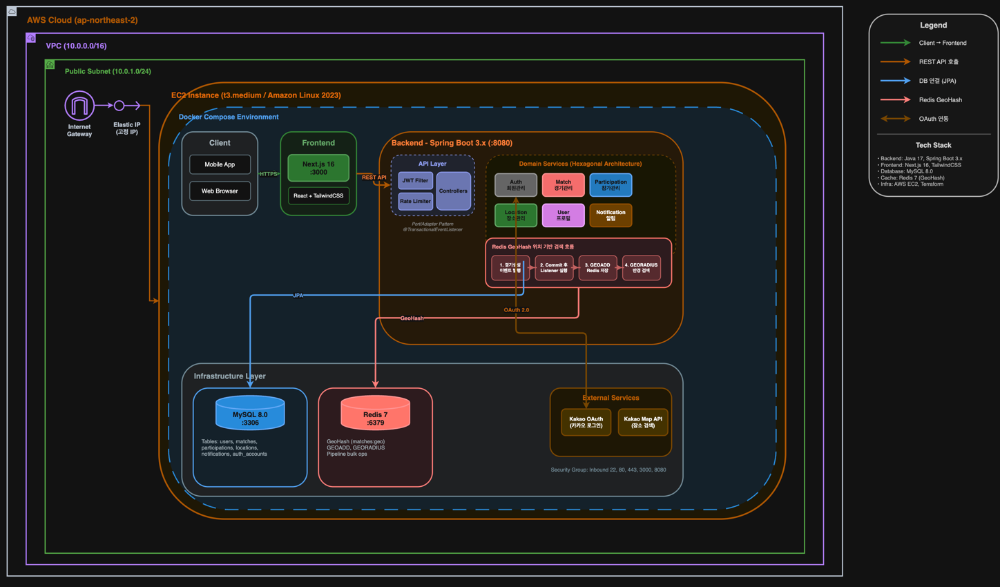

<div align="center">


# Hoops

Basketball match-making platform for finding and joining pickup games near you.

</div>

## Tech Stack

### Backend


### Frontend


### Infrastructure


## Architecture



- **Infra**: AWS EC2 + Docker Compose
- **Location Search**: Redis GeoHash (GEORADIUS)
- **Backend Design**: Hexagonal Architecture

### System Context

| External System | Integration | Purpose |
|-----------------|-------------|---------|
| Kakao OAuth | REST API | User authentication, social login |
| Kakao Maps | JavaScript SDK | Location search, map display |
| MySQL | JDBC | Data persistence |
| Redis | Spring Data Redis | GeoHash-based location search |

### Container Diagram

| Container | Technology | Responsibility |
|-----------|------------|----------------|
| Frontend | Next.js | UI, user interaction, map rendering |
| Backend API | Spring Boot | Business logic, REST API |
| MySQL | MySQL 8.0 | Match, User, Location, Participation data |
| Redis | Redis 7 | GeoHash spatial index, caching |

### Hexagonal Architecture

**Dependency Flow**: Adapter → Application → Domain (inward only)

| Layer | Location | Responsibility | Allowed Dependencies |
|-------|----------|----------------|---------------------|
| Domain | `{domain}/domain/` | Pure business logic, entities, value objects | None (pure Java) |
| Application | `{domain}/application/` | Use case orchestration, ports definition | Domain only |
| Adapter | `{domain}/adapter/` | External world integration (Web, DB, APIs) | Application, Domain |
| Infrastructure | `{domain}/infrastructure/` | Framework configuration | All layers |

**Package Structure per Domain**:

| Package | Contains | Example |
|---------|----------|---------|
| `domain/model/` | Entities with identity | `Match`, `User`, `Participation` |
| `domain/vo/` | Immutable value objects | `MatchStatus`, `ParticipationStatus` |
| `domain/repository/` | Repository interfaces | `MatchRepository` |
| `application/port/in/` | Use case interfaces | `CreateMatchUseCase` |
| `application/port/out/` | Outbound port interfaces | `MatchInfoPort`, `OAuthPort` |
| `application/service/` | Use case implementations | `MatchCreator`, `ParticipationJoiner` |
| `adapter/in/web/` | REST controllers | `MatchController` |
| `adapter/out/persistence/` | JPA adapters, entities | `MatchJpaAdapter` |
| `adapter/out/{external}/` | External API adapters | `KakaoOAuthAdapter` |

## Features

- **Kakao OAuth Login** - Social login with Kakao account
- **Location-based Match Search** - Find matches within specified distance
- **Match Creation** - Create matches with location, date, time, max participants
- **Participation Management** - Join/cancel matches, host approval/rejection
- **Notifications** - In-app notification system
- **My Page** - View participated and hosted matches

## Getting Started

### Prerequisites

- Docker & Docker Compose
- Kakao Developers Account (for OAuth & Maps API)

### 1. Environment Setup

**Backend** (`backend/.env`):
```env
KAKAO_CLIENT_ID=your-kakao-rest-api-key
KAKAO_CLIENT_SECRET=your-kakao-client-secret
JWT_SECRET=your-secret-key-must-be-at-least-32-characters-long
```

**Frontend** (`frontend/.env.local`):
```env
NEXT_PUBLIC_API_URL=http://localhost:8080
NEXT_PUBLIC_KAKAO_CLIENT_ID=your-kakao-rest-api-key
NEXT_PUBLIC_KAKAO_REDIRECT_URI=http://localhost:3000/auth/kakao/callback
NEXT_PUBLIC_KAKAO_JS_KEY=your-kakao-javascript-key
```

### 2. Kakao Developer Console Setup

1. Go to [Kakao Developers](https://developers.kakao.com/)
2. Create an application
3. Enable Kakao Login
4. Add redirect URI: `http://localhost:3000/auth/kakao/callback`
5. Add platform: `http://localhost:3000` (Web)
6. Get REST API Key, JavaScript Key

### 3. Run

```bash
docker-compose up -d
```

- **Frontend**: http://localhost:3000
- **Backend API**: http://localhost:8080
- **MySQL**: localhost:3306
- **Redis**: localhost:6379

## Frontend Pages

| Route | Description |
|-------|-------------|
| `/` | Main page - Map (50%) + Match list (50%) |
| `/login` | Kakao OAuth login |
| `/signup` | Nickname registration |
| `/matches/new` | Create new match |
| `/matches/[id]` | Match detail - join/cancel, host approval |
| `/locations/new` | Create new location with Kakao Places search |
| `/mypage` | Profile, participated & hosted matches |

## API Endpoints

### Auth
| Method | Endpoint | Description |
|--------|----------|-------------|
| GET | `/api/auth/kakao` | Get Kakao auth URL |
| GET | `/api/auth/kakao/callback` | Kakao OAuth callback |
| POST | `/api/auth/signup` | Complete registration |
| POST | `/api/auth/refresh` | Refresh token |

### Match
| Method | Endpoint | Description |
|--------|----------|-------------|
| POST | `/api/matches` | Create match |
| GET | `/api/matches` | List matches by location |
| GET | `/api/matches/{id}` | Get match detail |
| DELETE | `/api/matches/{id}` | Cancel match |
| GET | `/api/matches/hosted` | List my hosted matches |

### Participation
| Method | Endpoint | Description |
|--------|----------|-------------|
| POST | `/api/matches/{id}/participations` | Join match |
| DELETE | `/api/matches/{id}/participations/{pid}` | Cancel participation |
| PUT | `/api/matches/{id}/participations/{pid}/approve` | Approve (host) |
| PUT | `/api/matches/{id}/participations/{pid}/reject` | Reject (host) |
| GET | `/api/matches/{id}/participants` | List participants |

### User
| Method | Endpoint | Description |
|--------|----------|-------------|
| GET | `/api/users/me` | Get my profile |
| GET | `/api/users/me/participations` | List my participations |
| PUT | `/api/users/{id}` | Update profile |

### Location
| Method | Endpoint | Description |
|--------|----------|-------------|
| POST | `/api/locations` | Create location |
| GET | `/api/locations` | List locations |
| GET | `/api/locations/search` | Search locations |

### Notification
| Method | Endpoint | Description |
|--------|----------|-------------|
| GET | `/api/notifications` | List notifications |
| PUT | `/api/notifications/{id}/read` | Mark as read |
| GET | `/api/notifications/unread-count` | Get unread count |

## Project Structure

```
hoops/
├── backend/                 # Spring Boot API
│   └── src/main/java/com/hoops/
│       ├── auth/           # Authentication (Kakao OAuth)
│       ├── user/           # User management
│       ├── match/          # Match CRUD
│       ├── participation/  # Join/cancel logic
│       ├── location/       # Location management
│       ├── notification/   # In-app notifications
│       └── common/         # Shared utilities
├── frontend/               # Next.js App
│   └── app/
│       ├── page.tsx        # Main page
│       ├── login/          # Login page
│       ├── signup/         # Signup page
│       ├── matches/        # Match pages
│       ├── locations/      # Location pages
│       └── mypage/         # My page
├── docs/                   # Documentation
└── docker-compose.yml
```

## Documentation

- [Progress](docs/progress.md) - Current development status
- [Architecture](docs/architecture/architecture.md) - System design
- [API Specs](docs/api/) - Detailed API documentation
- [Conventions](docs/convention/) - Code conventions

## License

MIT
