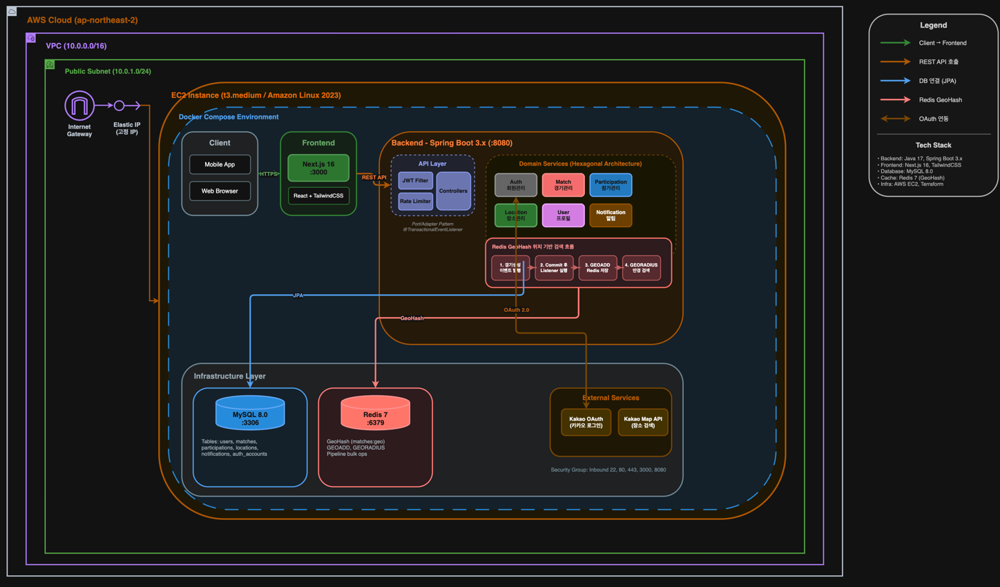

<div align="center">


# Hoops

내 주변 농구 경기를 찾고 참가할 수 있는 위치 기반 매칭 플랫폼

</div>

## 프로젝트 소개

동네에서 농구를 하고 싶은데 같이 할 사람을 찾기 어렵습니다.
커뮤니티 게시판에 올려도 시간/장소가 안 맞거나, 인원이 모이지 않아 무산되는 경우가 많습니다.

**Hoops**는 위치 기반으로 주변 농구 경기를 탐색하고, 원하는 경기에 바로 참가 신청할 수 있는 매칭 플랫폼입니다.

## 주요 기능

| 기능 | 설명 |
|------|------|
| **위치 기반 경기 탐색** | 카카오맵 + 거리/상태 필터로 주변 경기를 지도와 목록에서 동시 확인 |
| **경기 생성** | 장소, 날짜, 시간, 정원을 설정하여 경기 개설 |
| **참가 관리** | 참가 신청 → 호스트 승인/거절 → 참가 확정 플로우 |
| **알림** | 참가 신청/승인/거절/취소 시 실시간 알림 |
| **마이페이지** | 참가 예정 경기, 호스팅한 경기 관리 |

## 스크린샷

| 경기 조회 | 경기 상세 | 참가 신청 |
|:---------:|:---------:|:---------:|
|  |  |  |

| 경기 생성 | 매치 취소 | 정원 마감 |
|:---------:|:---------:|:---------:|
|  |  |  |

## 기술적 의사결정

### 1. Hexagonal Architecture 채택

서비스 계층이 JPA Entity에 직접 의존하면 도메인 로직과 인프라가 결합되어 테스트와 변경이 어려워집니다.
Port/Adapter 패턴으로 도메인을 순수 POJO로 유지하여, **프레임워크 교체 없이 비즈니스 로직을 독립적으로 테스트**할 수 있도록 설계했습니다.

### 2. 동시 참가 신청 처리 (낙관적 락 + 재시도)

정원이 1자리 남은 경기에 여러 명이 동시에 신청하면 정원 초과가 발생할 수 있습니다.
비관적 락 대신 **낙관적 락(@Version) + 3회 재시도(@Retryable)** 를 적용하여 충돌 빈도가 낮은 환경에서 처리량을 확보했습니다.

### 3. Redis GeoHash 기반 위치 검색

MySQL 공간 인덱스 대신 **Redis GEORADIUS**를 사용하여 반경 N km 이내 경기를 조회합니다.
읽기 빈도가 높은 위치 검색을 인메모리로 처리해 응답 속도를 확보했습니다.

### 4. 이벤트 기반 알림 시스템

참가 신청/취소 시 알림 생성을 동기 호출하면 참가 로직과 알림 로직이 결합됩니다.
**Spring Event**로 도메인 이벤트를 발행하고 비동기 Consumer가 알림을 생성하는 구조로 분리했습니다.

### 5. Cucumber BDD 테스트

비즈니스 요구사항을 `.feature` 파일로 문서화하고 그대로 자동화 테스트로 실행합니다.
현재 **23개 시나리오**가 인증, 경기 CRUD, 참가 플로우, 알림 등 주요 유스케이스를 커버합니다.

## 아키텍처



**의존성 방향**: Adapter → Application → Domain (안쪽으로만)

| Layer | 역할 | 의존 가능 대상 |
|-------|------|---------------|
| **Domain** | 순수 비즈니스 로직, Entity, VO | 없음 (순수 Java) |
| **Application** | UseCase 구현, Port 정의 | Domain |
| **Adapter** | 외부 연동 (Web, DB, API) | Application, Domain |
| **Infrastructure** | Spring 설정 | 모든 레이어 |

## 기술 스택

### Backend


### Frontend


### Infrastructure


### Test


## 실행 방법

### 사전 준비

- Docker & Docker Compose
- [Kakao Developers](https://developers.kakao.com/) 계정 (OAuth + Maps API)

### 1. 환경변수 설정

**Backend** (`backend/.env`):
```env
KAKAO_CLIENT_ID=your-kakao-rest-api-key
KAKAO_CLIENT_SECRET=your-kakao-client-secret
JWT_SECRET=your-secret-key-must-be-at-least-32-characters-long
```

**Frontend** (`frontend/.env.local`):
```env
NEXT_PUBLIC_API_URL=http://localhost:8080
NEXT_PUBLIC_KAKAO_CLIENT_ID=your-kakao-rest-api-key
NEXT_PUBLIC_KAKAO_REDIRECT_URI=http://localhost:3000/auth/kakao/callback
NEXT_PUBLIC_KAKAO_JS_KEY=your-kakao-javascript-key
```

**Docker Compose** (`.env`):
```env
MYSQL_ROOT_PASSWORD=your-mysql-password
SPRING_DATASOURCE_PASSWORD=your-mysql-password
JWT_SECRET=your-secret-key-must-be-at-least-32-characters-long
KAKAO_CLIENT_ID=your-kakao-rest-api-key
KAKAO_CLIENT_SECRET=your-kakao-client-secret
KAKAO_REDIRECT_URI=http://localhost:3000/auth/kakao/callback
NEXT_PUBLIC_KAKAO_CLIENT_ID=your-kakao-rest-api-key
NEXT_PUBLIC_KAKAO_JS_KEY=your-kakao-javascript-key
```

### 2. Kakao Developer Console 설정

1. [Kakao Developers](https://developers.kakao.com/) 에서 애플리케이션 생성
2. 카카오 로그인 활성화
3. Redirect URI 등록: `http://localhost:3000/auth/kakao/callback`
4. 플랫폼 등록: `http://localhost:3000` (Web)
5. REST API 키, JavaScript 키 확인

### 3. 실행

```bash
docker-compose up -d
```

| 서비스 | URL |
|--------|-----|
| Frontend | http://localhost:3000 |
| Backend API | http://localhost:8080 |
| API Docs (Swagger) | http://localhost:8080/swagger-ui.html |

## 프로젝트 구조

```
hoops/
├── backend/                    # Spring Boot API
│   └── src/main/java/com/hoops/
│       ├── auth/               # 카카오 OAuth, JWT 인증
│       ├── match/              # 경기 CRUD, 상태 스케줄러
│       ├── participation/      # 참가 신청/취소/승인/거절
│       ├── location/           # 장소 관리
│       ├── user/               # 사용자 프로필
│       ├── notification/       # 알림
│       └── common/             # 공통 (보안, 예외, 설정)
├── frontend/                   # Next.js App Router
│   └── app/
│       ├── (landing)/          # 랜딩 페이지
│       └── (app)/              # 서비스 페이지
│           ├── home/           # 메인 (지도 + 목록)
│           ├── matches/        # 경기 생성/상세
│           ├── mypage/         # 마이페이지
│           └── login/          # 로그인
├── .github/workflows/          # CI/CD (GitHub Actions)
├── docker-compose.yml          # 로컬 개발 환경
└── docs/                       # 프로젝트 문서
```

## 문서

| 문서 | 설명 |
|------|------|
| [기능 명세](docs/spec/SPEC.md) | 비즈니스 규칙, 상세 스펙 |
| [MVP 진행 현황](docs/spec/mvp-features.md) | 기능별 구현 상태 |
| [아키텍처](docs/architecture/architecture.md) | 시스템 설계 |
| [API 명세](docs/api/) | 엔드포인트 상세 |
| [코딩 컨벤션](docs/convention/) | 코드 작성 규칙 |

## License

MIT
