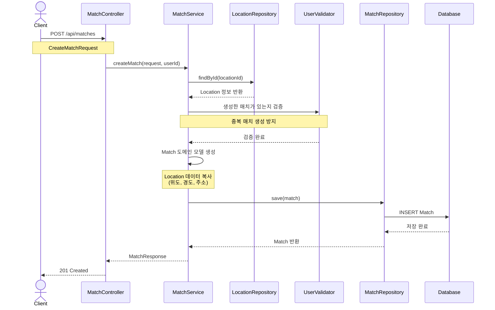

# 경기 생성 플로우 (Match Creation Flow)

## 개요
사용자가 새로운 농구 경기를 생성하는 전체 플로우를 정의합니다.

## 시퀀스 다이어그램

## 주요 단계

### 1. 매치 생성 요청
- **Endpoint**: `POST /api/matches`
- **Request**: `CreateMatchRequest` (locationId, title, description, matchDate, startTime, endTime, maxParticipants)
- **인증**: 필수 (로그인된 사용자만 가능)

### 2. Location 조회
- `locationId`로 Location 정보 조회
- Location이 존재하지 않으면 → `404 Not Found`
- Location의 위도, 경도, 주소를 Match에 복사

### 3. 중복 매치 검증 (선택적)
- 사용자가 이미 진행 중인 매치를 생성했는지 확인
- 중복이면 → `409 Conflict`

### 4. 도메인 모델 생성
- Match 도메인 모델 생성
- 도메인 불변식 검증:
  - 과거 날짜 불가
  - 종료 시간 > 시작 시간
  - 최대 참가 인원 > 0

### 5. 데이터 저장
- JPA Entity로 변환 (Mapper 사용)
- DB에 저장
- 기본 상태: `PENDING`
- 현재 참가 인원: `0`

### 6. 응답 반환
- `MatchResponse` DTO 반환
- HTTP Status: `201 Created`

## 아키텍처 레이어

| 레이어 | 컴포넌트 | 패키지 |
|--------|----------|--------|
| Adapter (In) | MatchController | `com.hoops.match.adapter.in.web` |
| Application | MatchService | `com.hoops.match.application.service` |
| Domain | Match, MatchValidator | `com.hoops.match.domain` |
| Adapter (Out) | MatchRepositoryImpl | `com.hoops.match.adapter.out.adapter` |

## 주요 예외

| 예외 | HTTP Status | 발생 조건 |
|------|-------------|-----------|
| `UnauthorizedException` | 401 | 인증되지 않은 사용자 |
| `LocationNotFoundException` | 404 | 존재하지 않는 Location |
| `InvalidMatchDateException` | 400 | 과거 날짜 또는 잘못된 시간 |
| `InvalidParticipantsException` | 400 | 유효하지 않은 참가 인원 |
| `DuplicateMatchCreationException` | 409 | 중복 매치 생성 (선택적) |

## 관련 문서
- [아키텍처 가이드](/docs/architecture/architecture.md)
- [컨벤션 가이드](/docs/convention/convention.md)
