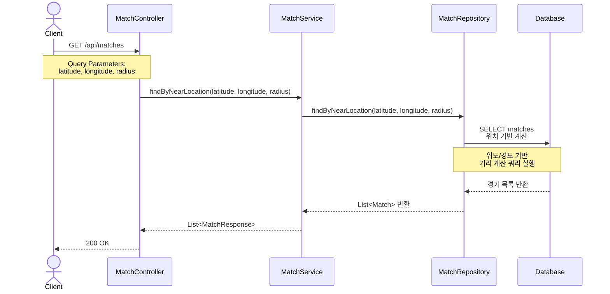

# 경기 조회 플로우 (Match List Flow)

## 개요
사용자의 현재 위치 기반으로 주변 경기 목록을 조회하는 플로우를 정의합니다.

## 시퀀스 다이어그램

## 주요 단계

### 1. 경기 조회 요청
- **Endpoint**: `GET /api/matches`
- **Query Parameters**:
  - `latitude` (필수): 사용자 현재 위도
  - `longitude` (필수): 사용자 현재 경도
  - `radius` (선택): 검색 반경 (기본값: 5km)
- **인증**: 선택 (비로그인 사용자도 조회 가능, 비즈니스 정책에 따라 결정)

### 2. 위치 기반 검색
- 사용자의 위도/경도를 기준으로 주변 경기 검색
- 거리 계산 알고리즘: Haversine Formula 또는 DB Spatial Function
- 검색 조건:
  - 지정된 반경 내의 경기
  - 상태가 `CANCELLED`가 아닌 경기
  - 경기 날짜가 과거가 아닌 경기 (선택적)

### 3. 데이터 조회
- matches 테이블에서 위치 기반 쿼리 실행
- 결과를 거리순으로 정렬 (가까운 순)
- 페이징 처리 (선택적)

### 4. 응답 반환
- `List<MatchResponse>` 반환
- HTTP Status: `200 OK`
- 빈 목록인 경우에도 200 반환 (빈 배열)

## 아키텍처 레이어

| 레이어 | 컴포넌트 | 패키지 |
|--------|----------|--------|
| Adapter (In) | MatchController | `com.hoops.match.adapter.in.web` |
| Application | MatchService | `com.hoops.match.application.service` |
| Domain | Match | `com.hoops.match.domain` |
| Adapter (Out) | MatchRepositoryImpl | `com.hoops.match.adapter.out.adapter` |

## 주요 예외

| 예외 | HTTP Status | 발생 조건 |
|------|-------------|-----------|
| `InvalidLocationException` | 400 | 유효하지 않은 위도/경도 값 |
| `InvalidRadiusException` | 400 | 유효하지 않은 반경 값 (음수 등) |

## 추가 고려사항

### 거리 계산 방식
- **Option 1**: Haversine Formula (애플리케이션 레벨)
- **Option 2**: MySQL Spatial Functions (ST_Distance_Sphere)
- **Option 3**: PostGIS (PostgreSQL 사용 시)

### 성능 최적화
- 위도/경도 인덱스 추가: `INDEX idx_match_location (latitude, longitude)`
- 페이징 처리로 대량 데이터 응답 방지
- 캐싱 적용 (Redis, 지역별 경기 목록)

### 필터링 옵션 (선택적 구현)
- 경기 날짜 범위 필터
- 경기 상태 필터 (PENDING, CONFIRMED 등)
- 정원 여부 필터 (정원 마감 제외)
- 최대 참가 인원 필터

## 관련 문서
- [아키텍처 가이드](/docs/architecture/architecture.md)
- [컨벤션 가이드](/docs/convention/convention.md)
- [경기 생성 플로우](/docs/sequence/00-match-creation)
- [경기 상세 조회 플로우](/docs/sequence/02-match-detail)
