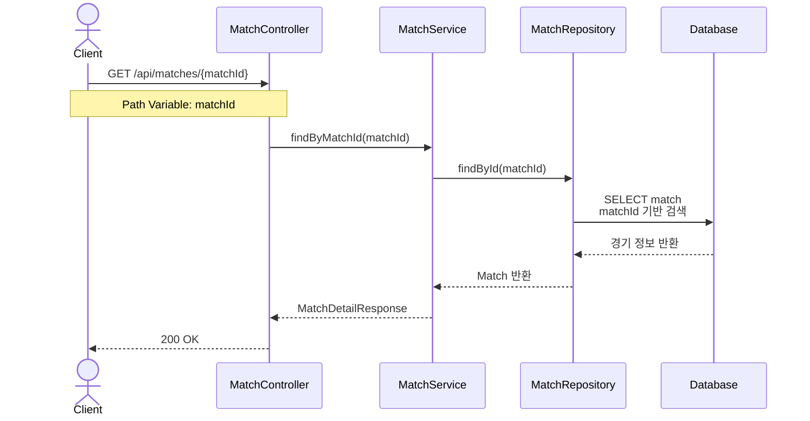

# 경기 상세 조회 플로우 (Match Detail Flow)

## 개요
특정 경기의 상세 정보를 조회하는 플로우를 정의합니다.

## 시퀀스 다이어그램

## 주요 단계

### 1. 경기 상세 조회 요청
- **Endpoint**: `GET /api/matches/{matchId}`
- **Path Variable**:
  - `matchId` (필수): 조회할 경기 ID
- **인증**: 선택 (비로그인 사용자도 조회 가능, 비즈니스 정책에 따라 결정)

### 2. 경기 ID로 검색
- `matchId`를 기준으로 경기 정보 조회
- DB에서 단건 조회 (Primary Key)
- 경기가 존재하지 않으면 → `404 Not Found`

### 3. 데이터 조회
- matches 테이블에서 ID 기반 조회
- 참가자 정보 포함 여부 결정 (선택적)
- 주최자(Host) 정보 JOIN (선택적)

### 4. 응답 반환
- `MatchDetailResponse` 반환
- HTTP Status: `200 OK`
- 경기 상세 정보 포함

## 아키텍처 레이어

| 레이어 | 컴포넌트 | 패키지 |
|--------|----------|--------|
| Adapter (In) | MatchController | `com.hoops.match.adapter.in.web` |
| Application | MatchService | `com.hoops.match.application.service` |
| Domain | Match | `com.hoops.match.domain` |
| Adapter (Out) | MatchRepositoryImpl | `com.hoops.match.adapter.out.adapter` |

## 주요 예외

| 예외 | HTTP Status | 발생 조건 |
|------|-------------|-----------|
| `MatchNotFoundException` | 404 | 존재하지 않는 경기 ID |
| `InvalidMatchIdException` | 400 | 유효하지 않은 matchId 형식 |

## 추가 고려사항

### 응답 정보 구성
- **기본 정보**: 경기 제목, 설명, 날짜/시간, 위치, 상태
- **주최자 정보**: 주최자 ID, 닉네임, 프로필 이미지, 평점
- **참가자 정보** (선택적):
  - 현재 참가 인원 / 최대 참가 인원
  - 참가자 목록 (간단한 정보)
  - 로그인한 사용자의 참가 여부
- **통계 정보** (선택적):
  - 조회수
  - 참가 신청 수

### 성능 최적화
- Primary Key 조회로 빠른 성능 보장
- N+1 문제 방지: 주최자/참가자 정보 JOIN 또는 Fetch Join
- 캐싱 적용 (Redis, 경기 상세 정보)

### 권한 관리
- 취소된 경기 조회 가능 여부
- 비공개 경기 조회 권한 (미래 확장)

## 관련 문서
- [아키텍처 가이드](/docs/architecture/architecture.md)
- [컨벤션 가이드](/docs/convention/convention.md)
- [경기 생성 플로우](/docs/sequence/00-match-creation)
- [경기 조회 플로우](/docs/sequence/01-match-list)
