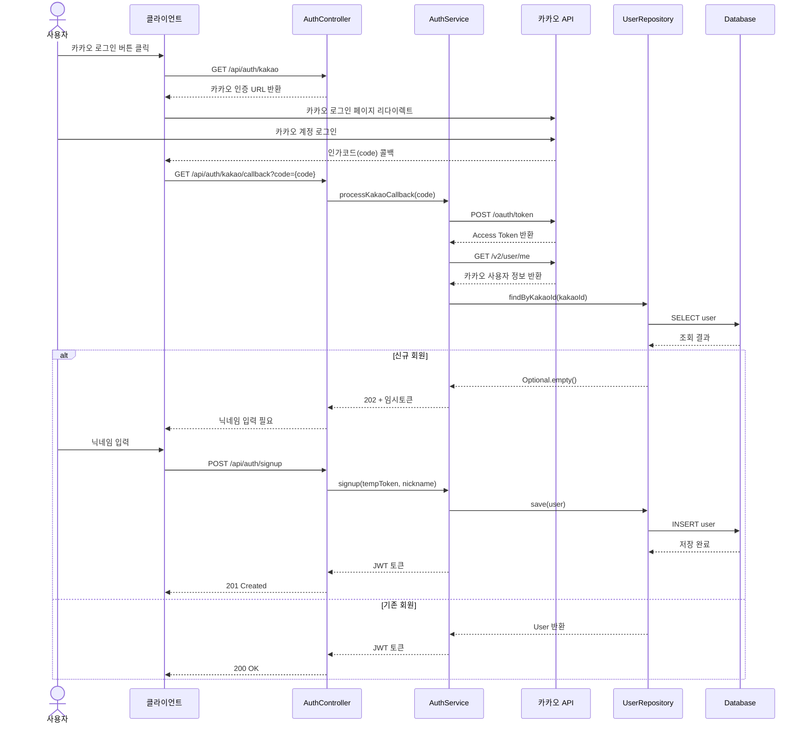

# 카카오 소셜 로그인 회원가입 플로우 (Kakao OAuth Signup Flow)

## 개요
카카오 OAuth 2.0을 활용한 소셜 로그인 및 회원가입 플로우를 정의합니다.
신규 회원은 닉네임 입력 후 가입이 완료되며, 기존 회원은 즉시 로그인됩니다.

## 시퀀스 다이어그램



## 주요 단계

### 1. 카카오 인증 URL 요청
- **Endpoint**: `GET /api/auth/kakao`
- **Response**: 카카오 인증 페이지 URL
- **인증**: 불필요

### 2. 카카오 콜백 처리
- **Endpoint**: `GET /api/auth/kakao/callback?code={code}`
- **처리 내용**:
  1. 인가코드로 Access Token 교환
  2. Access Token으로 사용자 정보 조회
  3. kakaoId로 기존 회원 여부 확인
- **Response**:
  - 신규 회원: `202 Accepted` + 임시 토큰
  - 기존 회원: `200 OK` + JWT 토큰

### 3. 회원가입 완료 (신규 회원만)
- **Endpoint**: `POST /api/auth/signup`
- **Request**: 임시 토큰 + 닉네임
- **Validation**: 닉네임 2~20자, 중복 불가
- **Response**: `201 Created` + JWT 토큰

### 4. 토큰 갱신
- **Endpoint**: `POST /api/auth/refresh`
- **Request**: Refresh Token
- **Response**: 새로운 Access Token

## 아키텍처 레이어

| 레이어 | 컴포넌트 | 패키지 |
|--------|----------|--------|
| Adapter (In) | AuthController | `com.hoops.user.adapter.in.web` |
| Application | AuthService | `com.hoops.user.application.service` |
| Application | KakaoOAuthClient | `com.hoops.user.application.service` |
| Domain | User | `com.hoops.user.domain` |
| Adapter (Out) | UserRepositoryImpl | `com.hoops.user.adapter.out.adapter` |
| Infrastructure | JwtTokenProvider | `com.hoops.common.security` |

## 주요 예외

| 예외 | HTTP Status | 발생 조건 |
|------|-------------|-----------|
| `InvalidAuthCodeException` | 400 | 유효하지 않은 인가코드 |
| `KakaoApiException` | 502 | 카카오 API 호출 실패 |
| `InvalidTempTokenException` | 400 | 만료되거나 유효하지 않은 임시 토큰 |
| `DuplicateNicknameException` | 409 | 이미 사용 중인 닉네임 |
| `InvalidNicknameException` | 400 | 닉네임 형식 오류 (2~20자) |
| `InvalidRefreshTokenException` | 401 | 유효하지 않은 리프레시 토큰 |

## 추가 고려사항

### JWT 토큰 설계
- **Access Token**: 유효기간 30분
- **Refresh Token**: 유효기간 14일
- **Temp Token**: 유효기간 10분 (회원가입 완료 전까지만 유효)

### 보안
- Refresh Token: HttpOnly 쿠키 권장
- 카카오 API Key: 백엔드 환경변수로 관리
- Client Secret: 필요시 추가 보안 적용

### 환경 설정
```yaml
kakao:
  client-id: ${KAKAO_CLIENT_ID}
  redirect-uri: ${KAKAO_REDIRECT_URI}

jwt:
  secret: ${JWT_SECRET}
  access-token-expiry: 1800000      # 30분
  refresh-token-expiry: 1209600000  # 14일
```

## 관련 문서
- [인증 API 명세서](/docs/api/03-auth-api.md)
- [아키텍처 가이드](/docs/architecture/architecture.md)
- [컨벤션 가이드](/docs/convention/convention.md)
