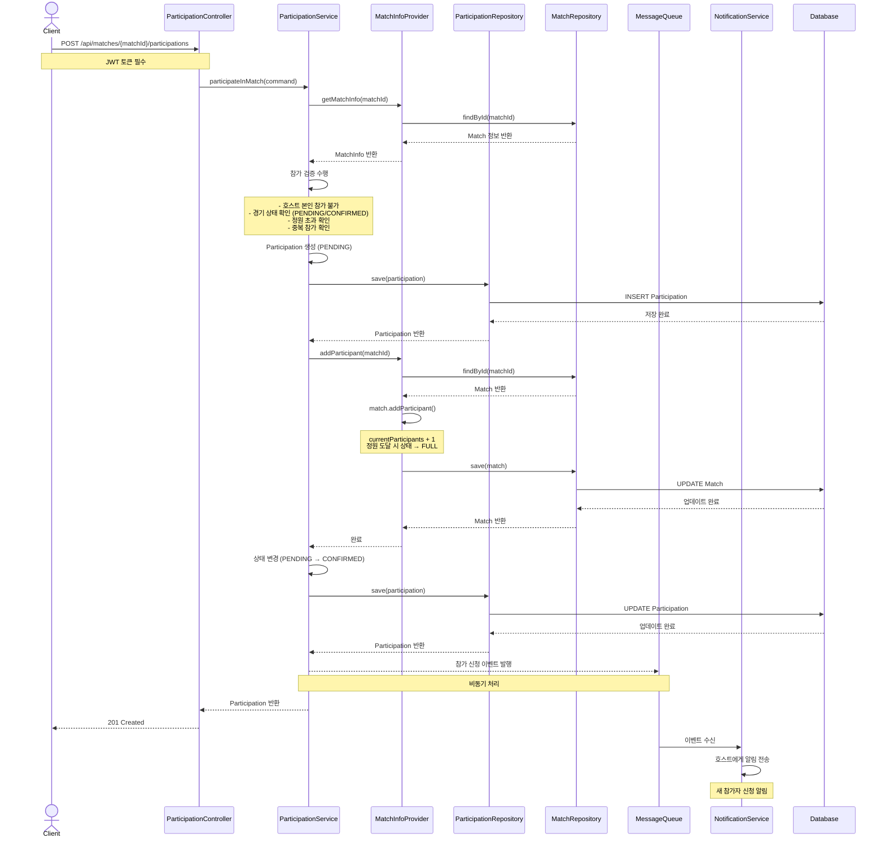

# 경기 참가 신청 플로우 (Match Participation Flow)

## 개요
사용자가 등록된 경기에 참가 신청하는 전체 플로우를 정의합니다.
동기적 처리 방식으로, 알림 이벤트만 비동기로 발행합니다.

## 시퀀스 다이어그램



## 주요 단계

### 1. 참가 신청 요청
- **Endpoint**: `POST /api/matches/{matchId}/participations`
- **인증**: JWT 필수 (로그인된 사용자만 가능)
- **Path Variable**: `matchId` - 참가할 경기 ID

### 2. 참가 검증
경기 참가 가능 여부를 검증합니다:
- 호스트 본인은 자신의 경기에 참가 불가
- 경기 상태가 PENDING 또는 CONFIRMED인 경우만 참가 가능
- 현재 참가자 수가 최대 참가자 수 미만인 경우만 참가 가능
- 이미 참가 신청한 사용자는 중복 참가 불가

### 3. 참가자 생성 (PENDING)
- `Participation` 도메인 모델 생성
- 초기 상태: `PENDING`
- DB에 저장 (1-1. RDB save)

### 4. 매치 서비스 호출
- Match 컨텍스트에 참가자 추가 요청
- 참가자 수 증가 (`currentParticipants + 1`)
- 정원 도달 시 경기 상태를 `FULL`로 변경
- DB 업데이트 (3-2. RDB update)

### 5. 참가 상태 확정 (CONFIRMED)
- 매치 서비스 응답 수신 후
- 참가 상태를 `PENDING` → `CONFIRMED`로 변경
- DB 업데이트 (4-2. RDB update)

### 6. 알림 이벤트 발행 (비동기)
- Message Queue를 통해 참가 신청 이벤트 발행
- 동기 처리 완료 후 비동기로 처리

### 7. 응답 반환
- `ParticipationResponse` DTO 반환
- HTTP Status: `201 Created`

### 8. 호스트 알림 (비동기)
- Message Queue에서 이벤트 수신
- 경기 호스트에게 새 참가자 신청 알림 전송

## Bounded Context 분리

### Participation Context → Match Context 통신

```
┌─────────────────────────────────────────────────────────────┐
│                  Participation Context                       │
│                                                              │
│  ParticipationService                                        │
│         │                                                    │
│         ▼                                                    │
│  MatchInfoProvider (port)                                    │
│         │                                                    │
│         ▼                                                    │
│  MatchInfoAdapter ─────────────────────────────────────────┐│
└─────────────────────────────────────────────────────────────┘│
                                                               │
                        uses external port                     │
                                                               │
┌──────────────────────────────────────────────────────────────┘
│                                                              │
│                        Match Context                         │
│                                                              │
│  MatchParticipationPort (external port)                      │
│         │                                                    │
│         ▼                                                    │
│  MatchParticipationAdapter                                   │
│         │                                                    │
│         ▼                                                    │
│  MatchRepository (internal)                                  │
└──────────────────────────────────────────────────────────────┘
```

## 아키텍처 레이어

| 레이어 | 컴포넌트 | 패키지 |
|--------|----------|--------|
| Adapter (In) | ParticipationController | `com.hoops.participation.adapter.in.web` |
| Application | ParticipationService | `com.hoops.participation.application.service` |
| Application Port (Out) | MatchInfoProvider | `com.hoops.participation.application.port.out` |
| Infrastructure | MatchInfoAdapter | `com.hoops.participation.infrastructure.adapter` |
| Domain | Participation | `com.hoops.participation.domain` |
| Adapter (Out) | ParticipationRepositoryImpl | `com.hoops.participation.infrastructure.adapter` |

## 상태 흐름

```
[신청] → PENDING → [매치 검증 성공] → CONFIRMED
                 → [매치 검증 실패] → 롤백 (삭제)
```

## 주요 예외

| 예외 | HTTP Status | 에러 코드 | 발생 조건 |
|------|-------------|-----------|-----------|
| `UnauthorizedException` | 401 | UNAUTHORIZED | 인증되지 않은 사용자 |
| `ParticipationMatchNotFoundException` | 404 | PARTICIPATION_MATCH_NOT_FOUND | 존재하지 않는 경기 |
| `HostCannotParticipateException` | 400 | HOST_CANNOT_PARTICIPATE | 호스트가 자신의 경기에 참가 시도 |
| `MatchFullException` | 400 | MATCH_FULL | 경기 정원 초과 |
| `InvalidMatchStatusException` | 400 | INVALID_MATCH_STATUS | 참가 불가능한 경기 상태 |
| `AlreadyParticipatingException` | 409 | ALREADY_PARTICIPATING | 중복 참가 신청 |

## 관련 문서
- [경기 생성 플로우](/docs/sequence/00-match-creation.md)
- [아키텍처 가이드](/docs/architecture/architecture.md)
- [컨벤션 가이드](/docs/convention/convention.md)
