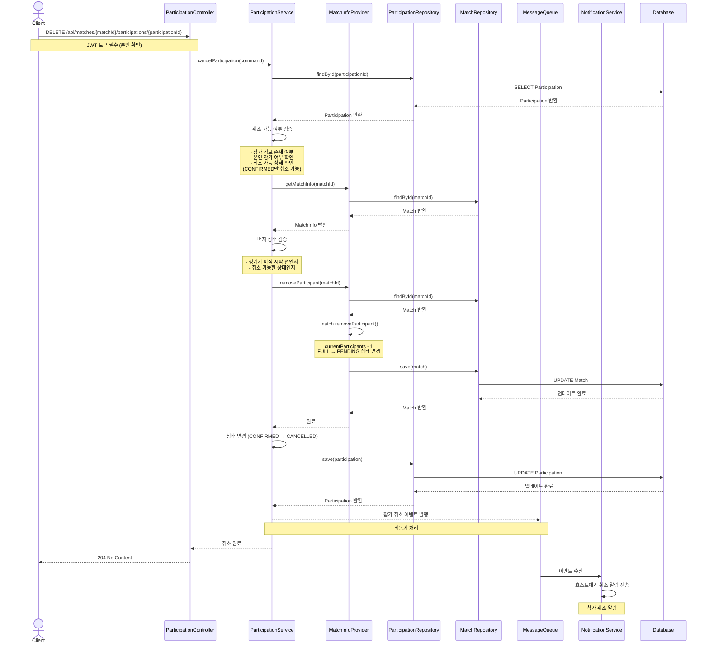

# 경기 참가 취소 플로우 (Participation Cancellation Flow)

## 개요
사용자가 참가 신청한 경기의 참가를 취소하는 전체 플로우를 정의합니다.
동기적 처리 방식으로, 알림 이벤트만 비동기로 발행합니다.

> **주의사항**: 참가 취소 로직 안에서 매치를 수정하는 메서드를 호출하기 때문에,
> 실패 시 매치의 상태를 원래대로 되돌리는 보상 트랜잭션 처리가 필요합니다.

## 시퀀스 다이어그램



## 주요 단계

### 0. 참가 취소 요청
- **Endpoint**: `DELETE /api/matches/{matchId}/participations/{participationId}`
- **인증**: JWT 필수 (본인만 취소 가능)
- **Path Variables**:
  - `matchId` - 경기 ID
  - `participationId` - 참가 ID

### 1. 취소 가능 여부 검증
참가 취소 가능 여부를 검증합니다:
- 참가 정보가 존재하는지 확인
- 요청자 본인의 참가인지 확인
- 취소 가능한 상태인지 확인 (CONFIRMED 상태만 취소 가능)
- 이미 취소된 참가는 재취소 불가

### 2. 매치 검증 및 상태 변경
Match 컨텍스트에 참가자 제거 요청:
- 2-1. 매치 상태 검증 (경기 시작 전인지 확인)
- 2-2. 참가자 수 감소 (`currentParticipants - 1`)
- 2-3. 상태 변경 (필요시): `FULL` → `PENDING`으로 변경
- 2-4. 검증 결과 반환
- 2.5. DB 업데이트

### 3. Persistence 처리
참가 상태 변경 및 저장:
- 3-1. 참가 상태를 `CONFIRMED` → `CANCELLED`로 변경
- 3-2. DB 업데이트

### 4. 알림 이벤트 발행 (비동기)
- Message Queue를 통해 참가 취소 이벤트 발행
- 호스트에게 참가자 취소 알림 전달

### 5. 취소 응답
- HTTP Status: `204 No Content`

## 보상 트랜잭션 (Compensating Transaction)

참가 취소 과정에서 Match 상태 변경 후 Participation 저장에 실패하면,
Match의 상태를 원래대로 되돌려야 합니다.

```
[정상 플로우]
Match 참가자 감소 → Participation 취소 → 완료

[실패 시 보상 트랜잭션]
Match 참가자 감소 → Participation 취소 실패 → Match 참가자 복원
```

### 구현 방안
1. **단일 트랜잭션**: 모든 작업을 하나의 트랜잭션으로 묶어 원자성 보장
2. **보상 로직**: 실패 시 Match의 `addParticipant()` 호출로 복원

## 상태 흐름

### Participation 상태
```
CONFIRMED → [취소 요청] → CANCELLED
```

### Match 상태 (참가자 수에 따른 변경)
```
FULL → [참가자 취소] → PENDING (자리 생김)
PENDING → [참가자 취소] → PENDING (유지)
```

## 주요 예외

| 예외 | HTTP Status | 에러 코드 | 발생 조건 |
|------|-------------|-----------|-----------|
| `UnauthorizedException` | 401 | UNAUTHORIZED | 인증되지 않은 사용자 |
| `ParticipationNotFoundException` | 404 | PARTICIPATION_NOT_FOUND | 존재하지 않는 참가 정보 |
| `NotParticipantException` | 403 | NOT_PARTICIPANT | 본인의 참가가 아님 |
| `InvalidParticipationStatusException` | 400 | INVALID_PARTICIPATION_STATUS | 취소 불가능한 상태 |
| `MatchAlreadyStartedException` | 400 | MATCH_ALREADY_STARTED | 이미 시작된 경기 |
| `ParticipationMatchNotFoundException` | 404 | PARTICIPATION_MATCH_NOT_FOUND | 존재하지 않는 경기 |

## Bounded Context 분리

### Participation Context → Match Context 통신

```
┌─────────────────────────────────────────────────────────────┐
│                  Participation Context                       │
│                                                              │
│  ParticipationService                                        │
│         │                                                    │
│         ▼                                                    │
│  MatchInfoProvider (port)                                    │
│    - getMatchInfo()                                          │
│    - removeParticipant()  ← 취소 시 호출                      │
│         │                                                    │
│         ▼                                                    │
│  MatchInfoAdapter ─────────────────────────────────────────┐│
└─────────────────────────────────────────────────────────────┘│
                                                               │
                        uses external port                     │
                                                               │
┌──────────────────────────────────────────────────────────────┘
│                                                              │
│                        Match Context                         │
│                                                              │
│  MatchParticipationPort (external port)                      │
│    - getMatchInfo()                                          │
│    - addParticipant()                                        │
│    - removeParticipant()  ← 취소 시 구현                      │
│         │                                                    │
│         ▼                                                    │
│  MatchParticipationAdapter                                   │
│         │                                                    │
│         ▼                                                    │
│  MatchRepository (internal)                                  │
└──────────────────────────────────────────────────────────────┘
```

## 아키텍처 레이어

| 레이어 | 컴포넌트 | 패키지 |
|--------|----------|--------|
| Adapter (In) | ParticipationController | `com.hoops.participation.adapter.in.web` |
| Application | ParticipationService | `com.hoops.participation.application.service` |
| Application Port (In) | CancelParticipationUseCase | `com.hoops.participation.application.port.in` |
| Application Port (Out) | MatchInfoProvider | `com.hoops.participation.application.port.out` |
| Infrastructure | MatchInfoAdapter | `com.hoops.participation.infrastructure.adapter` |
| Domain | Participation | `com.hoops.participation.domain` |
| Adapter (Out) | ParticipationRepositoryImpl | `com.hoops.participation.infrastructure.adapter` |

## 관련 문서
- [경기 참가 신청 플로우](/docs/sequence/04-match-participation.md)
- [경기 참가 신청 API](/docs/api/04-participation-api.md)
- [아키텍처 가이드](/docs/architecture/architecture.md)
